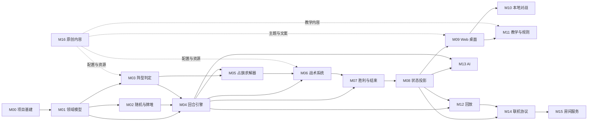

# 《古战阵》Web 游戏：17 模块说明

本文将项目拆分为 M00–M16 共 17 个模块，作为需求拆解、接口设计、测试和里程碑验收的统一索引。

## 1. 模块设计原则

1. 规则核心不依赖 React、DOM、网络、动画或本地存储。
2. UI 只能通过公开接口读取投影状态、提交命令，不能重复实现规则。
3. 所有随机行为必须由种子驱动；相同种子和命令序列必须得到相同结果。
4. 命令负责表达意图，事件负责记录已经发生的事实。
5. 每个模块必须提供稳定的输入、输出、错误码、测试和至少一个固定局面或示例。
6. 玩家私密信息、公开信息和服务端全量状态必须使用不同的数据边界。
7. M16 原创内容不能直接修改底层状态，只能通过规则配置、资源注册表和主题接口接入。

## 2. 总体依赖关系

## 3. 模块总览

| ID  | 模块       | 核心产物                               | 依赖          | 首次交付 |
| --- | ---------- | -------------------------------------- | ------------- | -------- |
| M00 | 项目基建   | Workspace、质量门禁、CI、ADR           | 无            | R0       |
| M01 | 领域模型   | 卡牌、玩家、战线、状态、命令与错误类型 | M00           | R1       |
| M02 | 随机与牌堆 | 种子 RNG、洗牌、发牌、抽牌             | M01           | R1       |
| M03 | 阵型判定   | 五类阵型、总和、完成先后比较           | M01           | R1       |
| M04 | 回合引擎   | 命令执行、事件日志、阶段流转、合法动作 | M01–M03       | R1       |
| M05 | 占旗求解器 | 正常占旗、提前占旗、反例 witness       | M03–M04       | R2       |
| M06 | 战术系统   | 10 张战术牌、持续效果、多步骤选择      | M04–M05       | R2       |
| M07 | 胜利与结束 | 连续 3／任意 5、结算摘要               | M04–M06       | R2       |
| M08 | 状态投影   | 玩家、观战、回放视图与信息隐藏         | M01–M07       | R2       |
| M09 | Web 桌面   | 对局页面、战线、手牌、交互反馈         | M08           | R3       |
| M10 | 本地对战   | 交接遮罩、存档、恢复、再战             | M09           | R3       |
| M11 | 教学与规则 | 引导局、速查、术语与规则示例           | M09–M10       | R4       |
| M12 | 回放       | 事件回放、局面码、导入导出             | M04、M08      | R4       |
| M13 | AI         | 合法策略、局面评估、难度与基准         | M04–M08       | R5       |
| M14 | 联机协议   | 版本化命令、状态同步、重连协议         | M04、M08、M12 | R6       |
| M15 | 房间服务   | 权威房间、邀请、重连、再战             | M14           | R6       |
| M16 | 原创内容   | 主题、名称、视觉、规则配置与差异化内容 | 跨模块        | 持续     |

## 4. 模块详细说明

### M00 — 项目基建

**目标**：提供可持续开发、自动检查和稳定发布的工程底座。

- 职责：Workspace 结构、TypeScript strict、ESLint、Prettier、Vitest、Playwright、构建、CI、ADR 和贡献规范。
- 输入：Node/pnpm 版本、部署目标、浏览器兼容范围、团队开发约定。
- 输出：统一脚本、目录约束、CI 工作流、构建产物和架构文档。
- 公开接口：`pnpm run typecheck`、`lint`、`test`、`build`、`test:e2e`、`check`。
- 非目标：不处理游戏规则、页面玩法或业务数据。
- 验收：干净环境可安装和构建；CI 全绿；`game-core` 不依赖 React、DOM 或网络。

### M01 — 领域模型

**目标**：建立所有规则模块共享、无歧义且可序列化的游戏语言。

- 职责：定义 `Card`、`Player`、`Flag`、`Formation`、`GameState`、`GamePhase`、`Command`、`Event`、`RuleError`。
- 输入：规则规格、卡牌目录、战线数量、阶段与错误语义。
- 输出：纯 TypeScript 类型、状态工厂、不变量检查器和规则版本号。
- 公开接口：`createEmptyGameState()`、`assertGameState()`、领域类型与稳定错误码。
- 不变量：实体牌位置唯一；数量守恒；容量合法；结束状态必须有胜者；进行中状态不能提前有胜者。
- 非目标：不负责洗牌、阵型计算或 UI 状态。
- 验收：非法重复牌、超容量、错误阶段和不一致胜者状态均能被检测。

### M02 — 随机与牌堆

**目标**：让开局、洗牌、发牌和抽牌完全可复现。

- 职责：种子哈希、伪随机数、Fisher–Yates 洗牌、60 张部队牌、战术牌堆、起手发牌和抽牌。
- 输入：字符串种子、牌组配置、起手数量、抽取牌堆。
- 输出：确定性的牌堆顺序、起手牌、抽牌事件或牌堆为空错误。
- 公开接口：`createSeededRandom()`、`shuffle()`、`createTroopDeck()`、`createBasicGame()`。
- 错误：无效卡牌值、空牌堆抽取、不允许的牌堆选择。
- 非目标：不决定卡牌应该打到哪里，也不计算战术效果。
- 验收：相同种子结果完全一致；不同种子通常不同；发牌后总数守恒。

### M03 — 阵型判定

**目标**：成为所有阵型强弱判断的唯一事实来源。

- 职责：识别楔形阵、方阵、营队阵、散兵线、军势；支持三牌和泥泞四牌；比较类别、总和与完成事件序号。
- 输入：阵型牌 ID、卡牌属性、完成事件序号、环境规则配置。
- 输出：`Formation`、强度、数值总和、排序值和比较结果。
- 公开接口：`evaluateFormation()`、`compareCompletedSides()`。
- 比较顺序：类别强度 → 数值总和 → 较早完成者。
- 非目标：不判断能否占旗，也不读取玩家手牌。
- 验收：五类阵型均有参数化 fixture；同类高低和完成顺序边界全部通过。

### M04 — 回合引擎

**目标**：通过纯函数命令执行形成完整、可回放的基础回合闭环。

- 职责：当前玩家、阶段流转、命令校验、不可变状态更新、事件追加、合法动作查询。
- 输入：`GameState` 和 `GameCommand`。
- 输出：新 `GameState`、`GameEvent`，或稳定 `RuleErrorCode`。
- 公开接口：`applyCommand()`、`validateCommand()`、`getLegalCommands()`。
- 基础阶段：部署 → 可选占旗 → 抓牌 → 换手；无牌可出或无牌可抓时使用显式跳过命令。
- 非目标：不处理 UI 动画、网络消息或 AI 决策。
- 验收：非法命令不修改输入状态；相同状态和命令得到相同结果；随机自动局无死锁。

### M05 — 占旗求解器

**目标**：严格按照公开信息判断一面旗帜能否被合法占领。

- 职责：双方完整阵型比较、公开可用牌集合、对手补全组合枚举、提前占旗证明和反例返回。
- 输入：宣告方完整阵型、对手当前阵型、公开牌、战线容量、环境效果和完成时序。
- 输出：`ClaimResult`，包含 `allowed`、原因码和可选 `witness`。
- `witness`：一组仍可能出现、足以击败宣告方的对手补全牌。
- 信息边界：不得使用宣告方手牌或隐藏牌堆顺序排除对手可能性。
- 非目标：不执行占旗后的胜利结算，也不直接修改游戏状态。
- 验收：覆盖对手 0/1/2/3 张、最多打平、公开弃牌、隐藏手牌和环境牌边界；目标耗时低于 50 ms。

### M06 — 战术系统

**目标**：用数据驱动和显式状态机实现全部 10 张战术牌。

- 职责：战术注册表、士气牌、环境牌、诡计牌、数量差限制、合法目标和多步骤选择。
- 输入：战术卡 ID、执行者、当前状态、目标与后续选择。
- 输出：领域事件、`PendingEffect`、合法后续命令或稳定错误码。
- 关键效果：统帅、盾牌、伙伴骑兵、雾、泥、侦察、重新部署、逃兵、叛徒等。
- 状态约束：存在 `PendingEffect` 时，只允许该效果声明的下一步命令。
- 非目标：不在 React 组件中保存战术流程，不负责动画表现。
- 验收：每张牌包含成功、非法目标、取消或无目标、容量边界测试；随机完整局无死锁。

### M07 — 胜利与结束

**目标**：集中处理占旗后的胜利检测和不可变结算结果。

- 职责：连续 3 条战线、任意 5 条战线、即时结束、胜利路径和结算摘要。
- 输入：最新旗帜所有权、玩家、种子、回合数和事件索引。
- 输出：`WinResult`、结束事件、结算 DTO。
- 公开接口：`detectVictory()` 和后续 `buildGameSummary()`。
- 稳定规则：同一动作同时满足两个条件时，使用固定优先级记录胜因。
- 非目标：不计算积分排行榜、账号奖励或匹配结果。
- 验收：两种胜利路径、同时触发、结束后拒绝命令和结算可序列化均通过。

### M08 — 状态投影

**目标**：让每个消费者只看到其权限允许的信息。

- 职责：玩家视图、对手信息隐藏、观战视图、回放视图和公开知识模型。
- 输入：服务端全量 `GameState`、查看者身份、投影用途与回放权限。
- 输出：`PlayerView`、`SpectatorView`、`PublicKnowledge` 或回放 DTO。
- 公开接口：`projectForPlayer()`、`projectForSpectator()`、`projectForReplay()`。
- 隐藏内容：对手手牌内容、未公开牌堆顺序、无权限的未来回放信息。
- 非目标：不负责 UI 布局，不允许调用者获得全量状态后自行删字段。
- 验收：DOM、日志、网络消息和 AI 输入均不存在隐藏信息；投影快照测试通过。

### M09 — Web 桌面

**目标**：把状态投影和合法命令转化为清晰、可操作的游戏桌面。

- 职责：首页、模式选择、对局设置、9 条战线、手牌、牌堆、阶段提示、目标高亮和错误反馈。
- 输入：`PlayerView`、合法命令列表、领域事件和本地交互状态。
- 输出：用户命令、可访问 DOM、视觉反馈和动画请求。
- 交互：点击与拖放共用同一命令提交路径；键盘用户可完成核心操作。
- 非目标：不自行计算阵型、胜负、占旗或合法目标。
- 验收：1440×900、1280×720 和移动横屏无关键遮挡；主要流程可由 Playwright 完成。

### M10 — 本地对战

**目标**：让两名玩家在同一浏览器中安全完成一局。

- 职责：交接设备遮罩、接管确认、自动保存、刷新恢复、再战和本地设置。
- 输入：领域状态、当前查看玩家、本地保存策略和对局配置。
- 输出：恢复后的对局、交接状态、结算页面和再战配置。
- 信息安全：交接前清除上一位玩家的手牌 DOM、焦点、日志细节和动画残留。
- 非目标：不提供账号系统、跨设备同步或在线房间。
- 验收：刷新恢复一致；交接期间无法读取对手手牌；非开发者可独立完成一局。

### M11 — 教学与规则

**目标**：让首次接触规则的玩家无需人工解释即可完成核心操作。

- 职责：规则速查、阵型示例、术语解释、无战术引导局、新手提示和错误原因文案。
- 输入：教学脚本、固定局面、玩家进度、当前合法命令与错误码。
- 输出：教学步骤、上下文提示、示例局面和规则页面。
- 教学顺序：部署 → 五类阵型 → 首次占旗 → 两种胜利 → 战术牌 → 提前占旗公开信息。
- 非目标：不修改规则以强行推进教学；教学特例必须通过规则配置显式表达。
- 验收：至少 70% 测试者无需协助完成首次占旗；测试完局率达到 80%。

### M12 — 回放

**目标**：通过事件日志准确复现任意已记录对局。

- 职责：事件序列重放、前进后退、跳转、种子复制、局面码和导入导出。
- 输入：规则版本、初始种子、命令或事件日志、目标事件索引。
- 输出：指定时点状态、文本战报、分享局面码和兼容性错误。
- 公开接口：`replayTo()`、`exportReplay()`、`importReplay()`、`formatBattleReport()`。
- 版本策略：回放必须记录规则版本；不兼容时明确拒绝或经过迁移器升级。
- 非目标：不存储视频，不允许回放绕过权限查看隐藏信息。
- 验收：任意事件可前后跳转；最终状态哈希与原局一致；争议局可通过日志重现。

### M13 — AI

**目标**：在不读取隐藏信息、不产生非法命令的前提下提供单人对战。

- 职责：合法随机策略、成型启发、威胁评估、连续战线价值、难度与思考时间预算。
- 输入：仅限 `PlayerView`、合法命令、AI 种子、难度和时间预算。
- 输出：一个合法 `GameCommand`、可选决策摘要和性能数据。
- 难度：简单为随机合法动作；标准加入阵型、威胁和机会成本；更强搜索后置。
- 非目标：不读取服务端全量状态，不修改规则引擎，不依赖 UI DOM。
- 验收：100 局 AI 自动对战可复现且无非法命令；标准 AI 对简单 AI 胜率显著高于 50%。

### M14 — 联机协议

**目标**：为客户端和权威服务端定义稳定、版本化的同步语言。

- 职责：命令信封、事件序列、状态投影、版本协商、序号、幂等、过期命令拒绝和重连快照。
- 输入：客户端命令、房间 ID、玩家身份、客户端版本和预期状态版本。
- 输出：命令确认、规则错误、事件增量、投影快照和升级提示。
- 安全边界：客户端只能提交意图；服务端执行 M04–M08 并返回对应玩家投影。
- 非目标：不负责房间生命周期、匹配队列或实际 WebSocket 连接管理。
- 验收：篡改状态无效；重复命令幂等；乱序与过期命令被明确拒绝；重连后状态一致。

### M15 — 房间服务

**目标**：提供稳定的邀请制双人实时对战运行环境。

- 职责：创建／加入房间、准备、身份绑定、权威状态、心跳、断线保留、重连和再战。
- 输入：房间命令、玩家连接、M14 协议消息、生命周期配置。
- 输出：房间状态、玩家投影、连接事件、错误和最小监控指标。
- 权威原则：房间服务持有全量状态；客户端缓存不能成为规则事实来源。
- 非目标：首版不提供天梯、赛事、观战大厅、好友或复杂反作弊系统。
- 验收：断网恢复一致；连续 50 局线上测试无不可恢复不同步；不能读取对手手牌。

### M16 — 原创内容

**目标**：将机制原型转化为具有独立主题、视觉和长期扩展能力的原创产品。

- 职责：正式名称、时代背景、六色映射、卡牌命名、视觉主题、音效方向、差异化规则和内容注册表。
- 输入：玩法测试、版权边界、用户研究、文化顾问意见和美术资源。
- 输出：内容规范、资源 ID、规则配置、主题包、术语表和版权检查记录。
- 接入方式：通过 `RulesetConfig`、卡牌注册表、文案键和主题资源映射进入其他模块。
- 非目标：不复制原作规则文字、名称体系、卡图、版式或品牌识别；不直接侵入引擎内部状态。
- 验收：所有资源来源可追踪；替换主题不改变基础规则测试；原创方向经过玩家测试和版权审查。

**M16-A 已交付**：建立 `@guzhanzhen/game-content` 内容注册表，接入工作名称《烽垒九章 · 六旌竞势》、架空澜原设定、六旌与谋策牌命名、阵型术语和 `beacon-night` 主题变量；底层规则 ID 保持不变。玩家测试、正式美术／音效资产和法务确认仍属于后续 M16 增量。

**M16-B 已交付**：建立六旌和三类谋策的符号／色值系统，卡面强调色由内容包驱动；产品内新增世界观与内容档案、三维认知问卷、本机保存和带版本 JSON 导出。该增量交付研究工具，不代表已经取得玩家样本或完成正式视觉与法务验收。

**M16-C 已交付**：参考用户提供的九垒／六旌视觉素材，将首页重构为全屏游戏主菜单，建立品牌主视觉、辅助导航、模式部署令、继续对局和联机入口的层级，并完成移动端纵向适配。图片文字不作为产品文案来源，标题与副标题由 HTML 独立呈现。

**M16-D 已交付**：将主菜单的九垒、六旌、烽火和印章语言延伸到实战桌面，为双阵使、烽垒归属、牌背、战况栏和行动令建立统一视觉反馈；背景资产路径与玩家强调色由内容包提供，规则、存档、回放和联机协议保持不变。

## 5. 建议实施顺序

| 阶段 | 模块                      | 阶段成果                       |
| ---- | ------------------------- | ------------------------------ |
| R0   | M00                       | 工程基线、CI、ADR              |
| R1   | M01–M04，M07 基础能力     | 可运行的无战术牌文本基础局     |
| R2   | M05–M08，M06/M07 完整能力 | 提前占旗、全部战术牌、信息隐藏 |
| R3   | M09–M10                   | 同设备双人 Web MVP             |
| R4   | M11–M12                   | 教学、回放与 Alpha 测试        |
| R5   | M13                       | 单人 AI 与体验打磨             |
| R6   | M14–M15                   | 邀请制在线对战 Beta            |
| 持续 | M16                       | 原创主题与内容演进             |

## 6. 跨模块完成定义

一个模块只有同时满足以下条件才可标记为完成：

- 接口、输入输出和稳定错误码已文档化。
- 单元测试、边界测试和固定示例已通过。
- 不读取或修改依赖模块的内部状态。
- 随机行为可以通过种子复现。
- 涉及隐藏信息时已经通过投影或防泄漏测试。
- 已加入 CI，且不会破坏既有模块测试。
- 路线图、ADR、规则版本或迁移说明已按影响范围更新。
